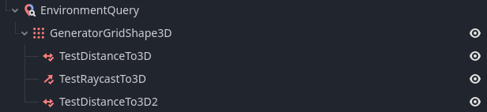

# GEQO

Godot Environment Query Orchestrator is a node based environment querying system for Godot 4 to find out the best position based on multiple tests done on the environment.
It is made in C++ as GDExtension for higher performance.

## Example Environment Query



## How to Use

```gdscript
var query_result: QueryResult = $EnvironmentQuery.request_query()
```

This will return a query result that you can then get a best position with the following:

```gdscript
var best_position: Vector3 = query_result.get_highest_score_position()
```
